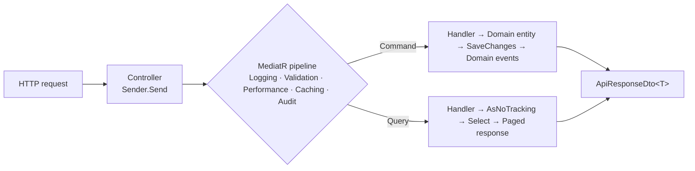

<div align="center">

# Template-net10

**A production-ready .NET 10 backend starter kit — Clean Architecture + CQRS + MediatR, wired into .NET Aspire.**

Batteries-included foundation you copy into new projects: authentication, RBAC, social login,
background jobs, caching, storage, localization, and more — with conventions that deliberately
mirror Laravel for a friendly developer experience.

[](https://dotnet.microsoft.com/)
[](LICENSE)
[](docs/ARCHITECTURE.md)
[](#contributing)

[Documentation](https://github.com/almoadi/Template-net10-docs) ·
[Architecture](docs/ARCHITECTURE.md) ·
[Agent Guide](AGENTS.md) ·
[Report a bug](https://github.com/almoadi/Template-net10/issues)

</div>

---

## Why this template?

Starting a new .NET backend usually means re-wiring the same plumbing: auth, validation, error
handling, logging, config, migrations, tests. **Template-net10** ships all of it, pre-assembled and
consistent, so you can focus on your domain from commit one.

It favors **clarity, consistency, and completeness** over cleverness — new code looks like the
existing code. Many building blocks intentionally mirror **Laravel** (a `config/` folder, seeders,
an `Auth` facade, YAML language files, Eloquent-style scopes and events) to keep things approachable.

---

## Features

### Core
- **Clean Architecture** — strict `Domain → Application → Infrastructure → API` dependency rule
- **CQRS + MediatR** — one folder per use case, commands vs. queries never mixed
- **.NET Aspire** — local orchestration, OpenTelemetry, health checks, HTTP resilience
- **EF Core (SQL Server)** — no Repository pattern; handlers use the `DbContext` directly
- **FluentValidation** pipeline, **Central Package Management**, **Scrutor** DI scanning

### API
- **API versioning** — URL-segment (`/api/v1/...`) with version-aware Swagger
- **Consistent response envelope** — `ApiResponseDto<T>` / `PagedApiResponseDto<T>` on every endpoint
- **Global exception handling** mapping domain errors to correct HTTP status codes
- **Pagination**, **rate limiting**, **correlation IDs**, **security headers**, **idempotency keys**
- **OpenAPI / Swagger UI** in development

### Auth & Security
- **JWT access tokens** + server-side **refresh-token sessions** (rotation & revocation)
- **RBAC** — users, roles, permissions with policy-based `[HasPermission]` / `[HasRole]`
- **Social login (Socialite-style)** — token-based **Google** and **Microsoft Entra ID (Azure)**
- **Optional account security** — email verification, password reset, two-factor (email OTP)
- **Encryption** (`Crypt`, AES-GCM) and **password hashing** abstractions

### Building blocks
- **Caching** — Memory or Redis, transparent query caching via the MediatR pipeline
- **File storage** — Local disk or **AWS S3** behind a swappable `IStorage` driver
- **Mail** — MailKit SMTP or a Log driver for local development
- **Background jobs** — Hangfire (`IJobScheduler`) with dashboard at `/hangfire`
- **Localization** — English & Arabic via YAML language files, resolved per request
- **Feature flags**, **Excel** (ClosedXML), **PDF** (QuestPDF), **realtime** (WebSockets)
- **Soft delete** global filter, **domain events**, **query scopes**, idempotent **seeders**

### Laravel-style ergonomics
- Static facades: `Auth`, `Cache`, `Storage`, `Crypt`, `Hash`, `Feature`, `Socialite`
- Split `config/*.json` files with per-environment overrides
- Eloquent-style local/global scopes and model events

---

## Tech stack

| Concern | Technology |
|---------|------------|
| Runtime / Web | .NET 10, ASP.NET Core |
| Orchestration | .NET Aspire |
| CQRS / Mediator | MediatR |
| Validation | FluentValidation |
| ORM | Entity Framework Core (SQL Server) |
| Auth | JWT bearer + refresh sessions, ASP.NET Identity password hasher |
| API versioning | Asp.Versioning |
| Caching | Memory or Redis |
| Storage | Local disk or AWS S3 |
| Mail | MailKit (SMTP / Log) |
| Background jobs | Hangfire |
| Localization | YAML (YamlDotNet) |
| Docs / Excel / PDF | Swashbuckle, ClosedXML, QuestPDF |
| Tests | NUnit, Moq, FluentAssertions, EF InMemory |

---

## Architecture

Dependencies point **inward**. The Domain depends on nothing; Infrastructure implements Application
and Domain abstractions.

```
API  →  Application  →  Domain
 │                        ▲
 └────  Infrastructure  ──┘
```

Request flow:



Full details live in [`docs/ARCHITECTURE.md`](docs/ARCHITECTURE.md) and the
[documentation site](https://github.com/almoadi/Template-net10-docs).

---

## Getting started

### Prerequisites

- [.NET 10 SDK](https://dotnet.microsoft.com/download) (`dotnet --version` → `10.x`)
- SQL Server (local, or via the included `docker-compose.yml`)
- [Node.js 18+](https://nodejs.org/) — only if you run the docs site

### Run it

```powershell
# 1. Clone
git clone https://github.com/almoadi/Template-net10.git
cd Template-net10

# 2. Run with Aspire (preferred — starts the API + dashboard)
dotnet run --project Template-net10.AppHost

# …or run the API alone
dotnet run --project src/API
```

The database is created and seeded automatically on first run. In development, open the Swagger UI
from the printed URL and the Hangfire dashboard at `/hangfire`.

### Default development credentials

| Field | Value |
|-------|-------|
| Email | `admin@template-net10.local` |
| Password | `ChangeMe!123` |

> **Change these before deploying anywhere shared.**

### Build & test

```powershell
dotnet build Template-net10.slnx
dotnet test  Tests/Template-net10.UnitTests/Template-net10.UnitTests.csproj
```

### Run with Docker

```powershell
docker compose up --build
```

---

## Start a new project from the template

This repo ships a `dotnet new` template that rebrands namespaces, folders, and identifiers for you:

```powershell
# Register the template once
dotnet new install .

# Scaffold a fresh, fully-renamed project
dotnet new cleanapi -n Acme.Shop -o C:\src\Acme.Shop
```

See [`docs/template-install.md`](docs/template-install.md) for details.

---

## Configuration

Settings live in `src/API/config/`, one JSON file per concern, each bound to a strongly-typed options
class and composed in `Program.cs` via `builder.AddSplitConfiguration()`. Per-environment overrides
go in `config/{Environment}/{name}.json`, and environment variables win last (12-factor friendly).

```
src/API/config/
├── app.json          ├── storage.json
├── database.json     ├── features.json
├── cache.json        ├── encryption.json
├── mail.json         ├── idempotency.json
├── jwt.json          ├── auth.json
├── queue.json        └── socialite.json
├── cors.json
```

> **Secrets** (JWT key, mail credentials, real connection strings) come from user-secrets,
> environment variables, or a vault — never committed.

---

## Project structure

```
Template-net10/
├── src/Domain/                  # entities, value objects, enums, domain events — no dependencies
├── src/Application/             # CQRS use cases, abstractions, behaviours, DTOs
├── src/Infrastructure/          # EF Core, services, auth, seeders, jobs, options
├── src/API/                     # ASP.NET host, controllers, config/, resources/
├── Tests/                       # NUnit unit tests
├── tools/Do/                    # `do` CLI (rename project, generate JWT key)
├── Template-net10.AppHost/      # .NET Aspire orchestrator
├── Template-net10.ServiceDefaults/  # Aspire telemetry / health / resilience
├── docs/                        # architecture & reference docs
└── AGENTS.md                    # operating guide for AI coding agents
```

---

## Tooling — the `do` CLI

```powershell
# Rebrand the whole solution (namespaces, folders, JWT issuer)
dotnet run --project tools/Do -- rename Acme.Shop

# Rotate the JWT signing key in config/jwt.json
dotnet run --project tools/Do -- key:generate --show
```

Full reference: [`docs/cli-do.md`](docs/cli-do.md).

---

## Documentation

- **[Documentation site](https://github.com/almoadi/Template-net10-docs)** — full, browsable guides
  (authentication, authorization, caching, storage, API versioning, and more)
- **[docs/ARCHITECTURE.md](docs/ARCHITECTURE.md)** — long-form architecture reference
- **[AGENTS.md](AGENTS.md)** — conventions and golden rules (also for AI coding agents)

---

## Contributing

Contributions are welcome! Please:

1. Fork the repo and create a feature branch.
2. Follow the conventions in [`AGENTS.md`](AGENTS.md) — match the existing structure and golden rules.
3. Ensure `dotnet build Template-net10.slnx` is clean and `dotnet test` passes.
4. Open a pull request describing the change.

For bugs and feature requests, please [open an issue](https://github.com/almoadi/Template-net10/issues).

---

## License

Released under the [MIT License](LICENSE). You are free to use it in personal and commercial projects.

---

<div align="center">

Built with .NET 10 · Clean Architecture · CQRS

If this project helps you, consider giving it a ⭐ on GitHub.

</div>
